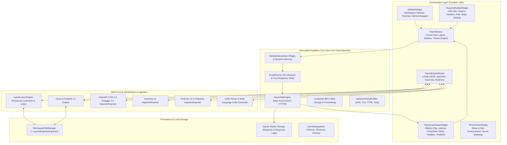

# PyRestForge — Desktop API Client & Testing Studio
## Master Technical Specification & Architecture Document

---

## 1. Executive Summary & Objectives

**PyRestForge** is a modern, high-performance, cross-platform **Desktop API Client and Testing Studio** written in Python. It provides the fluid user experience, elegant tree organization, and visual polish of **Insomnia**, with first-class support for **YAML and JSON collection import/export**, OpenAPI synchronization, asynchronous HTTP/2 network execution, dynamic environment variables, and Python-powered test assertions.

### Core Value Propositions:
1. **Insomnia-Grade Visual Hierarchy**: Deeply nested folders, requests, vibrant HTTP method badges, real-time filtering, and drag-and-drop reordering.
2. **Universal YAML & JSON Fluency**: Native YAML and JSON collection formats, with full bi-directional import and export support for OpenAPI 3.0/3.1, Swagger 2.0, Insomnia v4 bundles, and Postman v2.1 collections.
3. **High-Performance Async Engine**: Powered by `httpx` with connection pooling, HTTP/2 multiplexing, streaming payloads, detailed network latency timeline, and SSL/TLS certificate inspection.
4. **Dynamic Variable & Environment System**: Hierarchical environments (`Global > Workspace > Sub-Env > Folder > Runtime`) with `{{baseUrl}}` interpolation and built-in synthetic data generators (`{{$guid}}`, `{{$timestamp}}`, `{{$randomEmail}}`).
5. **Python-Native Scripting & Chaining**: Pre-request request mutations and post-response assertion suites with automatic token extraction into environment variables.
6. **Sleek Dark-Mode Desktop GUI**: Built using **PySide6 (Qt for Python)** for native rendering, smooth 60fps performance, and syntax highlighting without Electron overhead.

---

## 2. System Architecture & Component Layout



---

## 3. Technology Stack & Dependencies

| Layer | Technology / Library | Version | Justification |
| :--- | :--- | :--- | :--- |
| **Language** | Python | `>= 3.10` | Type hinting, structural pattern matching, native async/await |
| **GUI Framework** | `PySide6` | `>= 6.6.0` | Official Qt for Python bindings, native speed, robust QTreeView, dockable panels |
| **HTTP Client** | `httpx` | `>= 0.27.0` | Async HTTP/1.1 & HTTP/2 support, connection pooling, SSL context, streaming |
| **Data Schemas** | `pydantic` | `>= 2.7.0` | High-performance C-core validation, strict type models, JSON schema generation |
| **YAML Engine** | `ruamel.yaml` | `>= 0.18.0` | Round-trip YAML parsing with comment & ordering preservation |
| **Fast JSON** | `orjson` | `>= 3.10.0` | High-speed JSON serialization for large multi-MB payloads |
| **Syntax Highlighting** | `Pygments` | `>= 2.17.0` | Rich lexers for JSON, YAML, XML, HTML, GraphQL, Python, JavaScript |
| **OpenAPI Parser** | `openapi-spec-validator` | `>= 0.7.0` | Validates and resolves OpenAPI 3.0/3.1 schemas |
| **Testing** | `pytest`, `pytest-qt`, `respx` | Latest | Headless GUI testing, unit tests, and HTTP mocking |

---

## 4. Directory Layout

```text
python-api-tester/
│
├── AGENTS.md                        # AI Agent Operating Guidelines & Standards
├── PROJECT_SPEC.md                  # Master Architectural Blueprint (this file)
├── README.md                        # User setup, installation, and quickstart guide
├── requirements.txt                 # Pinned dependencies
├── pyproject.toml                   # Packaging configuration
├── run.bat / run.ps1 / run.sh       # One-click startup scripts
├── setup.bat                        # Setup and environment initialization script
│
├── doc/                             # Complete Authoritative Documentation Suite
│   ├── system_architecture.md       # High-level architecture, data flows, Mermaid diagrams
│   ├── feature_specifications.md    # Functional specs, request/response models, epics
│   ├── tech_stack_and_engine.md     # Technology choices, libraries, benchmarks
│   ├── ui_ux_design.md              # UI wireframes, theme tokens, shortcuts, component spec
│   ├── testing_and_verification.md  # Test suite strategy, mock server, coverage matrix
│   ├── user_manual.md               # User guide, workspace organization, scripting, import/export
│   └── project_documentation.md     # Implementation roadmap, agent tasks, milestones
│
├── src/
│   ├── main.py                      # Application entry point & Qt loop initialization
│   ├── core/                        # Decoupled Core Logic (Headless / Zero GUI imports)
│   │   ├── models/                  # Pydantic v2 domain schemas (Workspace, Folder, Request, Response, Env)
│   │   ├── engine/                  # HTTP client, variable interpolator, script sandbox, cookie jar
│   │   ├── serializers/             # YAML, JSON, OpenAPI, Insomnia, Postman, cURL converters
│   │   └── storage/                 # Local workspace file store, SQLite history log, config store
│   ├── gui/                         # Presentation Layer (PySide6)
│   │   ├── app.py                   # Main window and layout orchestration
│   │   ├── theme.py                 # Color tokens, fonts, and dark QSS stylesheets
│   │   ├── state.py                 # Reactive application state controller
│   │   ├── components/              # Modular widgets (Sidebar, UrlBar, RequestTabs, ResponseViewer, CodeEditor)
│   │   └── dialogs/                 # Modals (EnvDialog, ImportExport, CodeGen, Settings)
│   └── utils/                       # Shared formatters, logging, and helpers
│
├── tests/                           # Complete Test Suite (Unit, Serialization, GUI)
└── samples/                         # Example YAML, JSON, OpenAPI, and Insomnia files
```

---

## 5. Universal YAML & JSON Data Specification

### 5.1. PyRestForge Native YAML Collection Schema
```yaml
schema_version: "1.0.0"
workspace:
  id: "ws_ecommerce_api"
  name: "E-Commerce Microservices"
  description: "Product catalog, orders, and payment endpoints"
  environments:
    base:
      apiVersion: "v2"
      timeout: 30
    sub_environments:
      - name: "Local Development"
        variables:
          baseUrl: "http://localhost:5000"
          apiKey: "dev-key-local"
      - name: "Staging"
        variables:
          baseUrl: "https://staging.api.shop.com"
          apiKey: "stg-key-9482"
      - name: "Production"
        variables:
          baseUrl: "https://api.shop.com"
          apiKey: "{{SECRET:prod_api_key}}"
  folders:
    - id: "fld_products"
      name: "Products"
      requests:
        - id: "req_list_products"
          name: "List Products"
          method: "GET"
          url: "{{baseUrl}}/{{apiVersion}}/products"
          params:
            - key: "category"
              value: "electronics"
              active: true
            - key: "limit"
              value: "50"
              active: true
          headers:
            - key: "X-Api-Key"
              value: "{{apiKey}}"
              active: true
          auth:
            type: "none"
          body:
            mode: "none"
        - id: "req_create_product"
          name: "Create Product"
          method: "POST"
          url: "{{baseUrl}}/{{apiVersion}}/products"
          headers:
            - key: "Content-Type"
              value: "application/json"
              active: true
            - key: "X-Api-Key"
              value: "{{apiKey}}"
              active: true
          auth:
            type: "none"
          body:
            mode: "json"
            raw: |
              {
                "name": "Wireless Noise-Cancelling Headphones",
                "price": 199.99,
                "sku": "{{$guid}}",
                "in_stock": true
              }
          tests: |
            def test_create(res, env):
                assert res.status_code == 201
                data = res.json()
                assert "id" in data
                env.set("last_product_id", str(data["id"]))
```

---

## 6. Execution Guidelines for Development Agents

1. **Strict Architectural Separation**: No code in `src/core/` may import `PySide6` or any UI module. Core modules must be 100% testable headlessly via CLI and pytest.
2. **Asynchronous Non-Blocking Execution**: All network operations, heavy file parsing, and script execution must be offloaded to background threads (`QRunnable` / `QThreadPool`) to maintain 60 FPS UI responsiveness.
3. **Data Integrity & Round-Trip Fidelity**: YAML and JSON serialization must preserve all parameters, custom headers, script blocks, and environment bindings without data loss.
4. **Type Annotations & Error Handling**: All functions must contain Python 3.10+ type hints. Handle all exceptions gracefully with informative UI alerts and structured log records.
