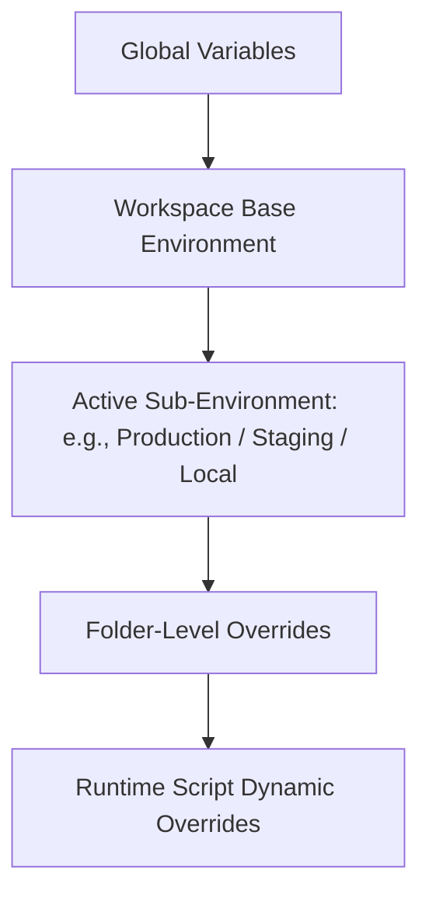
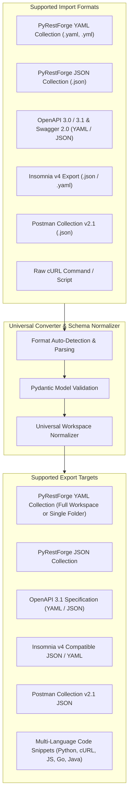

# Feature Specifications — PyRestForge (API Testing Studio)

> **Document Type**: Detailed Functional & Technical Requirements  
> **Status**: Approved Specification  
> **Target Audience**: Developers, QA Engineers, and AI Implementation Agents

---

## 1. Feature Matrix Overview

| Feature Category | Core Capability | Supported Standards / Formats | Priority |
| :--- | :--- | :--- | :--- |
| **Workspace & Collection Tree** | Hierarchical grouping of Workspaces, Folders, Subfolders, and Requests | Insomnia-like visual tree with Method Badges | **P0 (Critical)** |
| **Request Builder** | URL, Params, Headers, Auth, Multi-Type Body, Cookie Jar | HTTP/1.1, HTTP/2, HTTPS, GraphQL | **P0 (Critical)** |
| **Response Inspector** | Status chip, Latency (ms), Size (KB), Pretty/Raw/Preview viewer | JSON, XML, HTML, Image, PDF, Plain Text | **P0 (Critical)** |
| **Environment & Variables** | Multi-environment switcher (`{{baseUrl}}`), Dynamic Generators | Global, Workspace, Sub-environments | **P0 (Critical)** |
| **YAML & JSON Engine** | Bi-directional Import/Export with full fidelity | Native YAML/JSON, OpenAPI 3.0/3.1, Insomnia v4, Postman v2.1 | **P0 (Critical)** |
| **cURL Converter** | Paste cURL to Request, Copy Request as cURL | Standard POSIX & Windows cURL syntax | **P1 (High)** |
| **Scripting & Assertions** | Pre-request scripts & Post-response test assertions / chaining | Python runtime sandbox with helper utilities | **P1 (High)** |
| **Code Snippet Generator** | Multi-language request snippet generation | Python (requests/httpx), JS (fetch/axios), cURL, Go, Java, PHP | **P1 (High)** |
| **History & Timeline** | Execution log, SSL inspection, network timing breakdown | DNS, TLS Handshake, TTFB, Total Duration | **P2 (Medium)** |

---

## 2. Detailed Epic Specifications

### Epic 1: Workspace, Folder & Request Tree (Insomnia-like Arrangement)

#### 1.1. Hierarchical Tree Structure
- **Workspaces**: Top-level container representing an API project or domain (e.g., `Billing Service API`, `Authentication Gateway`).
- **Folders & Subfolders**: Arbitrarily deep nesting of folders with custom names and descriptions.
- **Requests**: Individual API endpoints linked to specific HTTP methods (`GET`, `POST`, `PUT`, `PATCH`, `DELETE`, `HEAD`, `OPTIONS`).
- **Visual Badging**:
  - `GET` : Vivid Emerald Green (`#10B981`)
  - `POST`: Royal Blue / Indigo (`#6366F1`)
  - `PUT` : Amber Orange (`#F59E0B`)
  - `PATCH`: Purple (`#8B5CF6`)
  - `DELETE`: Crimson Red (`#EF4444`)
  - `OPTIONS` / `HEAD`: Cool Slate (`#64748B`)
- **Operations & Context Menu**:
  - Drag-and-drop reordering between folders or within workspace root.
  - Right-click context actions: *Add Request*, *Add Folder*, *Duplicate*, *Rename*, *Delete*, *Export Selection (YAML/JSON)*, *Copy as cURL*.
  - Instant Filter/Search bar at the top of the sidebar with fuzzy match on request name, method, or URL path.

---

### Epic 2: Advanced Request Builder

#### 2.1. URL & Method Bar
- Method selector dropdown (`GET`, `POST`, `PUT`, `PATCH`, `DELETE`, `OPTIONS`, `HEAD`).
- URL text input supporting inline variable highlighting (e.g., `{{baseUrl}}/api/v1/users/{{userId}}`) with syntax glow.
- Action Buttons:
  - **Send Button** (`Ctrl+Enter`): Triggers async dispatch with dynamic spinner.
  - **Cancel Button**: Aborts ongoing inflight network request cleanly without freezing UI.

#### 2.2. Query Parameters Tab (`Params`)
- Dynamic table with columns: `[x] Active | Key | Value | Description`.
- Automatic bi-directional synchronization between the URL query string and the Params table.
- Bulk Edit mode: toggle to raw multi-line key-value text editor.

#### 2.3. Headers Tab (`Headers`)
- Dynamic key-value-description table with active toggles.
- Auto-completion for standard HTTP headers (e.g., `Content-Type`, `Authorization`, `Accept`, `User-Agent`).
- Auto-calculated headers section showing headers automatically attached by the client (e.g. `Host`, `Content-Length`, `User-Agent`).

#### 2.4. Authentication Tab (`Auth`)
Supports the following authentication schemas:
1. **No Auth**: Clear any auth headers.
2. **Bearer Token**: Token string field supporting variables `{{jwt_token}}` and token prefix configuration.
3. **Basic Auth**: Username and Password fields with base64 encoding preview.
4. **API Key**: Key name, Key value, and location selector (*Header* vs *Query Param*).
5. **OAuth 2.0**:
   - Grant Types: *Authorization Code*, *Client Credentials*, *Password Credentials*.
   - Fields: Access Token URL, Client ID, Client Secret, Scope, Token extraction, and *Fetch Token* button.
6. **Digest Auth**: Username, Password, Realm, Nonce calculation.
7. **Inherit from Parent**: Inherits folder-level or workspace-level authentication settings.

#### 2.5. Request Body Tab (`Body`)
Multi-mode selector with tailored editors:
1. **None**: No body payload attached.
2. **JSON**: Rich syntax-highlighted code editor with real-time JSON validation, error markers, and *Prettify / Minify* buttons.
3. **Multipart Form-Data**: Key-Value table supporting both Text fields and Binary File attachment pickers (with path selector and MIME type).
4. **Form URL-Encoded**: Key-Value table automatically serialized to `application/x-www-form-urlencoded`.
5. **Raw**: Plain text editor with syntax highlighter selector (*Text*, *XML*, *HTML*, *JavaScript*, *CSS*).
6. **GraphQL**: Dedicated split editor for GraphQL *Query / Mutation* and *Query Variables (JSON)* with automatic POST body packaging.
7. **Binary File**: Single file picker with preview for streaming file uploads (e.g., audio, images, archives).

#### 2.6. Cookie Jar Manager
- Persistent cookie storage per workspace / domain.
- Displays domain, path, cookie name, value, expiration, HttpOnly, and Secure flags.
- Ability to manually add, edit, clear, or disable automated cookie forwarding.

---

### Epic 3: High-Fidelity Response Inspector & Timeline

#### 3.1. Response Status Bar
- **Status Badge**: e.g., `200 OK` (Green), `201 Created` (Green), `400 Bad Request` (Orange), `401 Unauthorized` (Red), `500 Server Error` (Crimson).
- **Latency**: Precise millisecond duration (e.g. `142 ms`).
- **Response Size**: Formatted payload size (e.g., `3.45 KB`, `1.2 MB`).
- **Timestamp**: Exact execution time.
- **Copy / Save Actions**: Copy response body to clipboard, Save response payload to file.

#### 3.2. Response Body Presentation Modes
- **Pretty Mode**:
  - JSON: Auto-formatted, indented, syntax-highlighted with collapsible/foldable nodes.
  - XML/HTML: Tag highlighting and formatted indentation.
- **Raw Mode**: Unformatted bytes/text with line numbers and optional word wrapping.
- **Preview Mode**:
  - HTML: Rendered web page preview.
  - Images: In-app display of PNG, JPEG, GIF, SVG, WebP with dimensions and color depth.
  - Audio: Waveform and audio playback preview for media endpoints.
  - PDF: Page rendering preview.

#### 3.3. Response Headers & Cookies Tabs
- Filterable table of all headers returned by the server with one-click value copying.
- Cookie breakdown detailing Set-Cookie directives.

#### 3.4. Network Timeline & SSL Details
- **Timing Breakdown Bar**:
  - DNS Resolution Time
  - TCP Connection Establishment Time
  - TLS / SSL Handshake Duration
  - Time To First Byte (TTFB)
  - Content Download Duration
  - Total Elapsed Duration
- **SSL / TLS Certificate Inspector**:
  - Certificate Subject & Common Name (CN)
  - Issuer CA details
  - Valid from & Expiration date
  - Cipher Suite & TLS Protocol Version (e.g., TLSv1.3, AES-256-GCM)

#### 3.5. JSONPath / Regex Response Filter
- Real-time search/filter input at the bottom of the response inspector.
- Evaluates JSONPath expressions (e.g. `$.data.users[*].email`) and displays matched subsets instantly.

---

### Epic 4: Environment & Variable Interpolation Subsystem

#### 4.1. Multi-Level Environment Scope Hierarchy


- Variable Resolution Order: `Runtime Script` > `Folder` > `Active Sub-Environment` > `Workspace Base` > `Global`.

#### 4.2. Variable Syntax & Interpolation
- Standard double curly braces: `{{variable_name}}`.
- Works across URL, Query Params, Headers, Auth tokens, and Request Body.
- **Built-in Dynamic Generators**:
  - `{{$guid}}` or `{{$uuid}}`: Generates a random RFC 4122 UUID v4 (e.g. `c4a1b2c3-d4e5-...`).
  - `{{$timestamp}}`: Current Unix epoch in seconds (e.g. `1775123456`).
  - `{{$isoTimestamp}}`: Current ISO 8601 UTC timestamp (e.g. `2026-10-02T15:10:00Z`).
  - `{{$randomInt, min, max}}`: Random integer within bounds.
  - `{{$randomEmail}}`: Generates unique synthetic email address.
  - `{{$randomString, len}}`: Generates random alphanumeric string.

#### 4.3. Secret Variables & Masking
- Ability to flag variables as **Secret / Private** (e.g., API keys, passwords, bearer tokens).
- Masks value in UI (`••••••••••••`) with reveal toggle.
- Excluded from public YAML/JSON exports unless user explicitly confirms "Include Secrets in Export".

---

### Epic 5: Universal YAML & JSON Import / Export Engine

The application must be completely fluent in reading and writing structured API definitions.



#### 5.1. Native PyRestForge YAML & JSON Specification
- High-readability YAML format with clean indentation and schema versioning (`version: "1.0"`).
- Contains complete workspace hierarchy, environment variable definitions, folder structures, requests, headers, auth configs, and test scripts.
- Example YAML Collection snippet:
```yaml
schema_version: "1.0.0"
workspace:
  id: "ws_auth_gateway_001"
  name: "Auth & User Management Service"
  description: "Core authentication and profile management APIs"
  environments:
    base:
      baseUrl: "https://api.example.com"
      apiVersion: "v1"
    sub_environments:
      - name: "Local Development"
        variables:
          baseUrl: "http://localhost:8000"
          apiKey: "dev-secret-key-123"
      - name: "Production"
        variables:
          baseUrl: "https://api.example.com"
          apiKey: "{{SECRET:prod_key}}"
  folders:
    - id: "fld_users_001"
      name: "Users"
      description: "User CRUD operations"
      requests:
        - id: "req_get_users"
          name: "List All Users"
          method: "GET"
          url: "{{baseUrl}}/{{apiVersion}}/users"
          params:
            - key: "page"
              value: "1"
              active: true
            - key: "limit"
              value: "20"
              active: true
          headers:
            - key: "Accept"
              value: "application/json"
              active: true
          auth:
            type: "bearer"
            token: "{{jwt_token}}"
          tests: |
            def test_response(response, env):
                assert response.status_code == 200
                assert len(response.json()["data"]) > 0
```

#### 5.2. OpenAPI 3.0 / 3.1 & Swagger 2.0 Ingestion & Generation
- Ingests endpoints, HTTP methods, path parameters, query parameters, request bodies (JSON schemas), and example payloads.
- Generates fully compliant OpenAPI 3.1 YAML/JSON specs from any PyRestForge workspace or folder.

#### 5.3. Insomnia v4 & Postman v2.1 Bi-Directional Compatibility
- Full parsing support for Insomnia export bundles (`_type: export`, `resources: [...]`).
- Full parsing support for Postman v2.1 collection format (`info`, `item`, `event`, `variable`).
- Seamless migration path for developers moving from Insomnia or Postman.

---

### Epic 6: Scripting, Chaining & Automated Assertions

#### 6.1. Pre-Request Scripting (Python Sandbox)
- Executed immediately before the network request is transmitted.
- Context Object `req`:
  - `req.headers["X-Signature"] = generate_hmac(req.body)`
  - `req.url = req.url.replace(...)`
  - `env.set("temp_nonce", str(uuid.uuid4()))`

#### 6.2. Post-Response Test Runner & Token Chaining
- Executed immediately upon receiving a response.
- Context Objects: `res` (Response object) and `env` (Environment object).
- Enables automatic token extraction:
```python
def test_login_and_store_token(res, env):
    assert res.status_code == 200, f"Expected 200 OK, got {res.status_code}"
    data = res.json()
    assert "access_token" in data, "Response missing access_token"
    
    # Store token into active environment for subsequent requests
    env.set("jwt_token", data["access_token"])
    print(f"Successfully refreshed JWT token: {data['access_token'][:10]}...")
```
- Results displayed in a dedicated **Tests Result Tab** with green/red checkmarks and tracebacks.

---

### Epic 7: Multi-Language Code Snippet Generator

Generates ready-to-run code snippets directly from any configured request:
1. **Python (httpx - Async & Sync)**: Native Python with `httpx.Client()` or `httpx.AsyncClient()`.
2. **Python (requests)**: Standard `requests.request()`.
3. **cURL**: Complete `curl --location --request POST ...` with headers, auth, and escaped body.
4. **JavaScript (Fetch API & Axios)**: Modern ES6 `fetch()` and `axios.post()`.
5. **Go (`net/http`)**: Idiomatic Go HTTP client code.
6. **Java (HttpClient / OkHttp)**: Java 11+ `java.net.http.HttpClient` or `OkHttpClient`.
7. **PHP (cURL & Guzzle)**: Standard PHP scripts.

---

### Epic 8: Execution History & Persistence

- Stores every dispatched request and its corresponding response metadata in a local SQLite database or structured JSON store (`~/.pyrestforge/history.db`).
- Allows users to view historical runs, compare latency differences, and restore past request configurations with a single click.
- Automatic periodic auto-save of active workspace state to prevent data loss.
