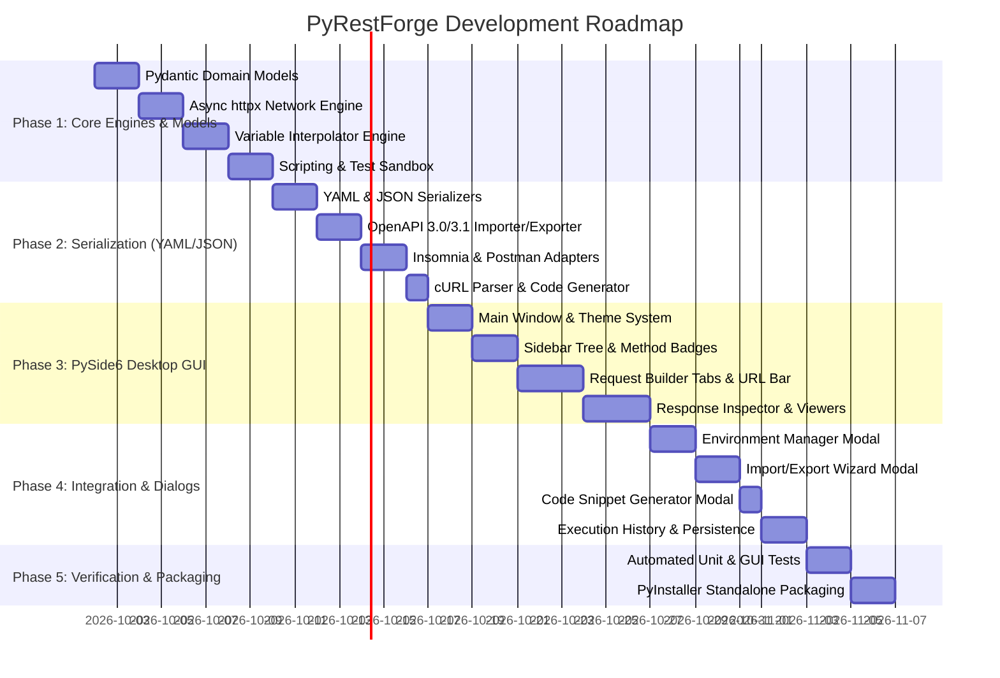

# Project Documentation & Implementation Roadmap — PyRestForge

> **Document Type**: Project Blueprint, Implementation Roadmap & Agent Execution Plan  
> **Status**: Approved Implementation Plan  
> **Target Python Version**: Python 3.10+

---

## 1. Project Implementation Roadmap

The implementation is broken down into **5 logical phases** designed for step-by-step agent execution with automated verification at every stage.

---

## 2. Agent Implementation Task Breakdown

### Phase 1: Core Data Models & Headless Engines
- [x] **Task 1.1**: Implement Pydantic v2 domain models in `src/core/models/`:
  - `workspace.py`, `folder.py`, `request.py`, `response.py`, `environment.py`, `auth.py`, `history.py`.
- [x] **Task 1.2**: Implement the Asynchronous HTTP Engine in `src/core/engine/http_client.py`:
  - Support `httpx.AsyncClient`, all HTTP methods, custom headers, cookies, redirects, timeouts, SSL toggles, and stream transfers.
- [x] **Task 1.3**: Implement the Variable Interpolator in `src/core/engine/interpolator.py`:
  - Handle `{{var}}` template evaluation, hierarchy scoping, and dynamic generator macros (`{{$guid}}`, `{{$timestamp}}`, `{{$randomEmail}}`).
- [x] **Task 1.4**: Implement the Scripting Sandbox in `src/core/engine/script_runner.py`:
  - Execute pre-request scripts and post-response assertion suites with safe namespaces and timeout protection.
- [x] **Task 1.5**: Implement Cookie Jar and SSL Certificate handlers in `src/core/engine/cookie_manager.py` and `cert_manager.py`.

### Phase 2: Serialization & Multi-Format Engine (YAML / JSON)
- [x] **Task 2.1**: Implement native YAML serializer/deserializer with comment preservation in `src/core/serializers/yaml_serializer.py`.
- [x] **Task 2.2**: Implement native JSON serializer with `orjson` / `pydantic` in `src/core/serializers/json_serializer.py`.
- [x] **Task 2.3**: Implement OpenAPI 3.0/3.1 & Swagger 2.0 importer and exporter in `src/core/serializers/openapi_parser.py`.
- [x] **Task 2.4**: Implement Insomnia v4 format parser & exporter in `src/core/serializers/insomnia_parser.py`.
- [x] **Task 2.5**: Implement Postman v2.1 collection parser & exporter in `src/core/serializers/postman_parser.py`.
- [x] **Task 2.6**: Implement cURL command parser and multi-language code generator in `src/core/serializers/curl_parser.py`.

### Phase 3: PySide6 Desktop GUI (Presentation Layer)
- [x] **Task 3.1**: Create Application Shell and Theme Engine in `src/gui/app.py` and `src/gui/theme.py` with modern dark styling and custom QSS.
- [x] **Task 3.2**: Implement `SidebarWidget` (`src/gui/components/sidebar.py`) with hierarchical QTreeView, custom Method Badge delegates, and drag-and-drop support.
- [x] **Task 3.3**: Implement `UrlBarWidget` (`src/gui/components/url_bar.py`) with method selector, variable highlighting, and Send/Cancel actions.
- [x] **Task 3.4**: Implement `RequestTabsWidget` (`src/gui/components/request_tabs.py`) with Params table, Headers table, Auth panel, Body editor (JSON, Form-Data, GraphQL), and Script editor.
- [x] **Task 3.5**: Implement `ResponseViewerWidget` (`src/gui/components/response_viewer.py`) with Status chip, Latency/Size indicators, Pretty/Raw/Preview modes, Headers table, Cookies table, and Timeline graph.
- [x] **Task 3.6**: Implement syntax-highlighted code editors with `Pygments` and `QSyntaxHighlighter` in `src/gui/components/code_editor.py`.

### Phase 4: State Integration, Dialogs & Persistence
- [x] **Task 4.1**: Implement `EnvironmentDialog` (`src/gui/dialogs/env_dialog.py`) for managing global, workspace, and sub-environment variables.
- [x] **Task 4.2**: Implement `ImportExportDialog` (`src/gui/dialogs/import_export.py`) wizard supporting YAML, JSON, OpenAPI, Insomnia, and Postman.
- [x] **Task 4.3**: Implement `CodeGenDialog` (`src/gui/dialogs/code_gen_dialog.py`) for generating Python, cURL, JavaScript, Go, Java, and PHP snippets.
- [x] **Task 4.4**: Implement `HistoryWidget` and SQLite storage in `src/core/storage/history_store.py`.
- [x] **Task 4.5**: Implement local workspace auto-save and file management in `src/core/storage/workspace_store.py`.

### Phase 5: Verification, Benchmarking & Packaging
- [x] **Task 5.1**: Build automated unit test suite with `pytest` covering 100% of serializers and HTTP engines.
- [x] **Task 5.2**: Build GUI integration tests using `pytest-qt`.
- [x] **Task 5.3**: Create standalone packaging scripts with `PyInstaller` and batch launchers (`run.bat`, `run.ps1`, `setup.bat`).

---

## 3. Module Responsibility Matrix

| Module Path | Primary Responsibility | Dependencies |
| :--- | :--- | :--- |
| `src/core/models/` | Pydantic v2 Schemas for all workspace entities | `pydantic` |
| `src/core/engine/` | Asynchronous network execution, variable interpolation, scripting | `httpx`, `jinja2`, `ast` |
| `src/core/serializers/` | Bi-directional YAML, JSON, OpenAPI, Insomnia, Postman, cURL conversion | `ruamel.yaml`, `orjson`, `prance` |
| `src/core/storage/` | Local workspace disk persistence and execution history DB | `sqlite3`, `pathlib` |
| `src/gui/components/` | Reusable PySide6 UI widgets (Tree, UrlBar, Tabs, Response, Editors) | `PySide6`, `pygments` |
| `src/gui/dialogs/` | Modal dialogs (Environments, Import/Export, Code Gen, Settings) | `PySide6` |
| `src/utils/` | Shared formatters, logging, platform helpers | Standard Library |

---

## 4. Definition of Done (DoD) for Implementation Agents

An implementation phase or task is considered **Complete** only when:
1. All functions and methods have strict **Python 3.10+ type annotations**.
2. **Zero GUI blocking**: Heavy I/O, parsing, and network calls are executed on background threads.
3. Complete **try-except error handling** and structured logging are present.
4. Comprehensive **pytest unit tests** exist and pass with $\ge 85\%$ test coverage.
5. Code passes `flake8` / `ruff` linting and conforms to PEP 8 standards.
