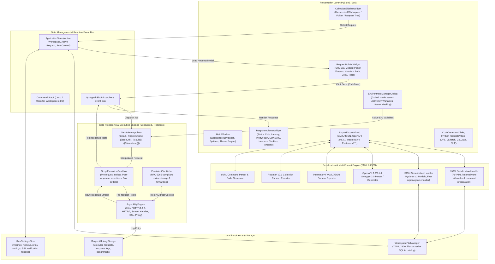
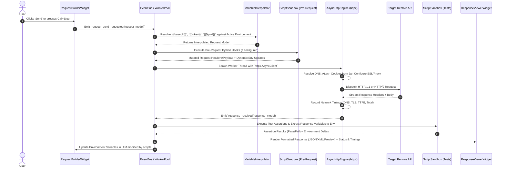
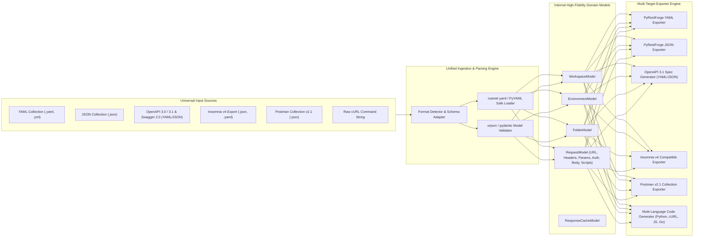

# System Architecture — PyRestForge (API Testing Studio)

> **Status**: Approved Architectural Blueprint  
> **Software Category**: Cross-Platform Desktop REST & GraphQL API Client & Testing Studio (Python / Qt)  
> **Target Python Version**: Python 3.10+  
> **Target GUI Framework**: PySide6 (Qt for Python)

---

## 1. High-Level System Architecture

`PyRestForge` is designed as a **modular, decoupled desktop API client** inspired by Insomnia. The system maintains strict separation between the **Presentation Layer (PySide6 GUI)**, the **Core Execution & Orchestration Engine (Asynchronous HTTP/2 Client)**, the **Data Model & Environment Subsystem**, and the **Import/Export Serialization Engines (YAML/JSON/OpenAPI/Postman/cURL)**.



---

## 2. Component Responsibility & Subsystem Breakdown

### 2.1. Presentation Layer (`src/gui/`)
- **Main Window (`src/gui/app.py`)**: Hosts the primary three-pane split layout (Left: Collections Tree; Center: Request Builder; Right: Response Inspector), global header toolbar, status bar, and menu system.
- **Theme & Style Engine (`src/gui/theme.py`)**: Implements an Insomnia-grade Dark/Light design system using curated QSS (Qt Style Sheets), custom SVG icons, JetBrains Mono/Inter typography, and vibrant HTTP method badges.
- **Collection Tree (`src/gui/components/sidebar.py`)**: TreeView with custom item delegates rendering Method Badges (GET, POST, etc.), folder icons, workspace switcher dropdown, drag-and-drop hierarchy reordering, context menus (Add Folder, Add Request, Duplicate, Rename, Delete, Export).
- **Request Builder (`src/gui/components/request_builder.py`)**:
  - **URL Bar**: Method dropdown, URL input field with inline variable highlighting/autocomplete, Send button, Cancel button, and Environment dropdown.
  - **Tabs**:
    - `Params`: Query string parameter key-value-description table with enable/disable checkboxes.
    - `Headers`: Custom and system headers key-value table, bulk text editor, preset headers.
    - `Auth`: No Auth, Bearer Token, Basic Auth, API Key (Header/Query), OAuth 2.0 (token retrieval & refresh), Digest Auth.
    - `Body`: Sub-mode switcher (None, JSON, Form-Data multipart, Form-Urlencoded, Raw Text/XML/HTML, GraphQL Query & Variables, Binary File).
    - `Pre-request Script`: Python scripting editor for computing signatures, timestamps, or setting dynamic variables.
    - `Tests / Assertions`: Post-response test script editor (status code checks, response JSONPath assertions, auto-saving response tokens to environment).
- **Response Inspector (`src/gui/components/response_viewer.py`)**:
  - **Status Header**: HTTP Status Chip (200 OK green, 404 red, 500 dark red), Latency badge (`124 ms`), Payload size badge (`4.2 KB`), Timestamp.
  - **View Modes**:
    - *Pretty*: Collapsible JSON tree, XML/HTML syntax highlighted, auto-formatted.
    - *Raw*: Plain text representation with word wrap and line numbers.
    - *Preview*: Rendered HTML web view or Image preview (PNG, JPEG, SVG, WebP) / PDF preview.
  - **Response Headers Tab**: Key-value table with one-click copy.
  - **Response Cookies Tab**: Domain, Path, Value, Expiry, HttpOnly, Secure flags.
  - **Network Timeline & SSL Tab**: DNS Lookup time, TCP Connect time, TLS Handshake duration, TTFB (Time to First Byte), Total Download time, Certificate CN, Issuer, Expiry.
  - **JSONPath Search Bar**: Real-time filtering and querying of JSON response structures.

---

## 3. Asynchronous HTTP Execution & Middleware Pipeline



---

## 4. Multi-Format Serialization & Import/Export Architecture

The core serialization layer supports bi-directional conversion between internal Pydantic models and universal industry standards.



---

## 5. Concurrency & Threading Model

To ensure a **100% fluid, non-blocking UI** at 60 FPS:
1. **Main UI Thread**: Runs the Qt Event Loop (`QApplication.exec()`). Responsible only for rendering, user input handling, and widget updates.
2. **QThreadPool & QRunnable**:
   - `HttpRequestWorker`: Executes network I/O via `httpx` asynchronously on background worker threads.
   - `ImportExportWorker`: Performs heavy YAML/JSON file parsing, large schema migrations, and file writing off the UI thread.
   - `ScriptExecutionWorker`: Runs pre-request scripts and response assertion scripts in a sandboxed thread with execution timeout limits (e.g. 5 seconds max).
3. **Thread Safety**: All communication from worker threads to the UI layer occurs strictly via **Qt Signals and Slots** (`pyqtSignal` / `Signal`), preventing race conditions, UI freezes, or segmentation faults.

---

## 6. Directory Structure & Modular Layout

```text
python-api-tester/
│
├── AGENTS.md                        # AI Agent Operating Guidelines & Standards
├── PROJECT_SPEC.md                  # Master Architectural Blueprint & Core Specs
├── README.md                        # Installation, Quickstart, and Feature Guide
├── requirements.txt                 # Pinned dependencies for production & dev
├── pyproject.toml                   # Project metadata and tool configuration
├── run.bat / run.ps1 / run.sh       # One-click launch scripts
│
├── doc/                             # Authoritative Documentation Suite
│   ├── system_architecture.md       # High-level architecture, data flows, Mermaid diagrams
│   ├── feature_specifications.md    # Functional specs, request/response models, epics
│   ├── tech_stack_and_engine.md     # Technology choices, libraries, benchmarks
│   ├── ui_ux_design.md              # UI wireframes, theme tokens, shortcuts, component spec
│   ├── testing_and_verification.md  # Test suite strategy, mock server, coverage matrix
│   ├── user_manual.md               # User guide, workspace organization, scripting, import/export
│   └── project_documentation.md     # Implementation roadmap, agent tasks, milestones
│
├── src/
│   ├── __init__.py
│   ├── main.py                      # Application entry point & Qt initialization
│   │
│   ├── core/                        # Headless Core Business Logic (Zero GUI dependencies)
│   │   ├── __init__.py
│   │   ├── models/                  # Pydantic v2 domain models
│   │   │   ├── __init__.py
│   │   │   ├── workspace.py         # Workspace & project schemas
│   │   │   ├── folder.py            # Hierarchical folder structure
│   │   │   ├── request.py           # HTTP Request model (URL, method, headers, auth, body)
│   │   │   ├── response.py          # HTTP Response model (status, headers, body, timings)
│   │   │   ├── environment.py       # Global, workspace, and sub-environment variables
│   │   │   ├── auth.py              # Auth models (Basic, Bearer, APIKey, OAuth2, Digest)
│   │   │   └── history.py           # Execution history entry schemas
│   │   │
│   │   ├── engine/                  # Network & Execution Engine
│   │   │   ├── __init__.py
│   │   │   ├── http_client.py       # Async HTTP/1.1 & HTTP/2 client using httpx
│   │   │   ├── interpolator.py      # Variable interpolation engine {{var}} & generators
│   │   │   ├── script_runner.py     # Python script execution sandbox for pre/post scripts
│   │   │   ├── cookie_manager.py    # RFC 6265 cookie jar manager
│   │   │   ├── cert_manager.py      # SSL certificate & client cert handler
│   │   │   └── network_timing.py    # Detailed DNS, TLS, TTFB network timeline profiler
│   │   │
│   │   ├── serializers/             # Multi-Format Ingestion & Export Engine
│   │   │   ├── __init__.py
│   │   │   ├── yaml_serializer.py   # High-fidelity YAML serializer/deserializer
│   │   │   ├── json_serializer.py   # Fast JSON serializer/deserializer
│   │   │   ├── openapi_parser.py    # OpenAPI 3.0 / 3.1 & Swagger 2.0 importer/exporter
│   │   │   ├── insomnia_parser.py   # Insomnia v4 Export YAML/JSON parser & generator
│   │   │   ├── postman_parser.py    # Postman Collection v2.1 importer & exporter
│   │   │   └── curl_parser.py       # cURL command parser & multi-language code generator
│   │   │
│   │   └── storage/                 # Data Persistence & File I/O
│   │       ├── __init__.py
│   │       ├── workspace_store.py   # Local workspace file storage manager
│   │       ├── history_store.py     # Execution history storage
│   │       └── config_store.py      # User preferences and app settings
│   │
│   ├── gui/                         # Presentation Layer (PySide6 / Qt6)
│   │   ├── __init__.py
│   │   ├── app.py                   # Main Window & primary layout orchestration
│   │   ├── theme.py                 # Design tokens, dark/light palette, QSS stylesheets
│   │   ├── state.py                 # Application state controller & Qt signals
│   │   │
│   │   ├── components/              # Modular Reusable UI Widgets
│   │   │   ├── __init__.py
│   │   │   ├── sidebar.py           # Workspace, Folder, and Request TreeView
│   │   │   ├── url_bar.py           # Method selector, URL input, Send/Cancel buttons
│   │   │   ├── request_tabs.py      # Tab container (Params, Headers, Auth, Body, Scripts)
│   │   │   ├── key_value_table.py   # Reusable Key-Value-Description table with checkboxes
│   │   │   ├── auth_widget.py       # Multi-type Authentication configuration widget
│   │   │   ├── body_widget.py       # Multi-mode Body editor (JSON, Form, Raw, GraphQL, File)
│   │   │   ├── response_viewer.py   # Response Inspector, Pretty/Raw/Preview, Status, Timings
│   │   │   ├── code_editor.py       # Syntax-highlighted code editor (JSON/YAML/Python)
│   │   │   └── history_widget.py    # Request execution history drawer
│   │   │
│   │   └── dialogs/                 # Modal & Configuration Windows
│   │       ├── __init__.py
│   │       ├── env_dialog.py        # Environment variables manager dialog
│   │       ├── import_export.py     # Import/Export wizard (YAML, JSON, OpenAPI, Postman)
│   │       ├── code_gen_dialog.py   # Multi-language code snippet generator modal
│   │       ├── settings_dialog.py   # App settings (Proxy, SSL, Timeout, Font size)
│   │       └── cert_dialog.py       # Client SSL Certificates manager
│   │
│   └── utils/                       # Shared Utilities
│       ├── __init__.py
│       ├── logger.py                # Structured rotating logger
│       ├── syntax_highlighter.py    # PySide6 QSyntaxHighlighter for JSON, YAML, XML, Python
│       ├── formatters.py            # Data size (KB/MB), latency (ms), JSON/XML pretty printers
│       └── helpers.py               # Path helpers, platform detection, clipboard wrappers
│
├── tests/                           # Comprehensive Test Suite
│   ├── __init__.py
│   ├── conftest.py                  # Pytest fixtures, mock HTTP servers, sample YAML/JSON
│   ├── test_http_engine.py          # Network client, methods, headers, auth, timeouts
│   ├── test_interpolator.py         # Variable interpolation & generator tests
│   ├── test_yaml_serializer.py      # YAML import/export fidelity tests
│   ├── test_json_serializer.py      # JSON import/export tests
│   ├── test_openapi_parser.py       # OpenAPI 3.0/3.1 import/export tests
│   ├── test_insomnia_parser.py      # Insomnia v4 import/export tests
│   ├── test_postman_parser.py       # Postman v2.1 import/export tests
│   ├── test_curl_parser.py          # cURL parsing & code generation tests
│   ├── test_script_runner.py        # Pre-request and test assertion sandbox tests
│   └── test_gui_components.py       # PySide6 widget tests with pytest-qt
│
└── samples/                         # Sample Collection & Environment Files
    ├── sample_collection.yaml       # PyRestForge native YAML collection sample
    ├── sample_collection.json       # PyRestForge native JSON collection sample
    ├── sample_openapi.yaml          # Sample OpenAPI 3.1 specification
    ├── sample_insomnia_export.json  # Sample Insomnia v4 export file
    └── sample_postman_v21.json      # Sample Postman v2.1 collection
```
