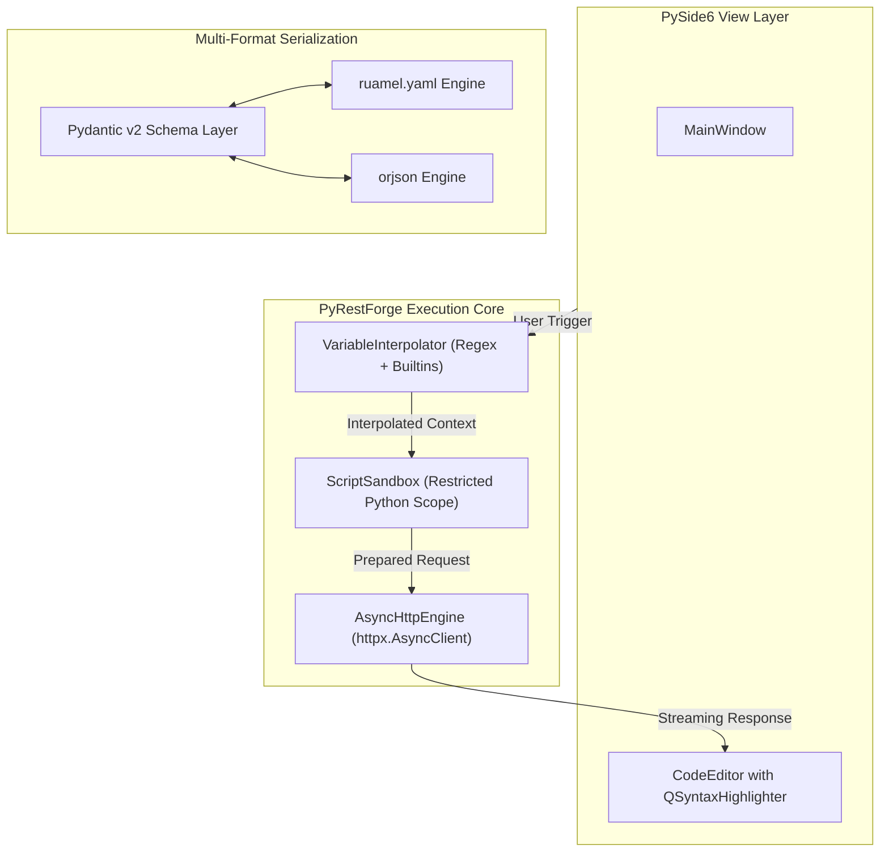

# Technology Stack & Engine Architecture — PyRestForge

> **Document Type**: Technical Decisions, Library Rationale & Engine Deep-Dive  
> **Status**: Approved Architecture  
> **Target Python Version**: Python 3.10+

---

## 1. Technical Stack Selection Matrix

| Subsystem | Selected Library / Tool | Evaluated Alternatives | Rationale for Selection |
| :--- | :--- | :--- | :--- |
| **Desktop GUI Framework** | **PySide6 (Qt for Python 6)** | Tkinter, CustomTkinter, PyQt6, Flet, Electron | Native performance, rich QTreeView, dockable widgets, built-in QThreadPool, robust styling (QSS), native OS look and feel, multi-platform stability without Electron bloat. |
| **Asynchronous HTTP Client** | **httpx (v0.27+)** | `requests`, `aiohttp`, `urllib3` | Native support for HTTP/1.1 and **HTTP/2**, synchronous & asynchronous APIs, connection pooling, SSL context handling, streaming uploads/downloads, robust timeout controls. |
| **Data Validation & Schemas** | **Pydantic v2 (v2.7+)** | `marshmallow`, `dataclasses`, `attrs` | High-performance C-core validation, strict type coercion, instant JSON serialization, direct OpenAPI schema generation. |
| **YAML Engine** | **ruamel.yaml** & **PyYAML** | `pyyaml` alone | `ruamel.yaml` preserves key ordering, comments, and block style formatting during round-trip edits; essential for editing team YAML files. |
| **JSON Parser & Encoder** | **orjson** / **stdlib json** | `ujson`, `simplejson` | Fastest Python JSON library for handling massive multi-megabyte API payloads without freezing or memory spikes. |
| **Syntax Highlighting** | **Pygments** + **PySide6 QSyntaxHighlighter** | Scintilla, QScintilla | Lightweight, zero-external-binary dependency, rich lexers for JSON, YAML, XML, HTML, GraphQL, Python, JavaScript, and SQL. |
| **Variable Interpolation** | **Regex + Custom Safe Evaluator** | `jinja2`, `eval()` | Fast templating for `{{var}}` syntax and built-in dynamic functions (`{{$guid}}`, `{{$timestamp}}`) without arbitrary code execution vulnerabilities. |
| **Script Execution Sandbox** | **Restricted Python Namespace (`exec` in isolated dict)** | JavaScript V8 (PyExecJS), Lua | Pure Python consistency, allowing users to write standard Python assertions and helper functions with access to `res` and `env`. |
| **OpenAPI / Swagger Ingestion** | **openapi-spec-validator** / **prance** | Custom regex | Robust schema validation and automatic resolution of `$ref` pointers in complex OpenAPI definitions. |
| **Testing Framework** | **pytest**, **pytest-asyncio**, **pytest-qt**, **respx** | `unittest` | Comprehensive unit and GUI testing, mocking HTTP calls with `respx`, and headless Qt widget validation via `pytest-qt`. |
| **Packaging & Distribution** | **PyInstaller** / **Nuitka** | Briefcase, cx_Freeze | Single-file / standalone folder desktop binary compilation for Windows (`.exe`), macOS (`.app`/`.dmg`), and Linux (`.AppImage`). |

---

## 2. Core Engine Subsystems



---

## 3. Network Engine: `httpx` Integration & Performance

### 3.1. HTTP/2 & Connection Pooling
`PyRestForge` utilizes a persistent `httpx.AsyncClient` pool per workspace to maximize throughput and enable HTTP/2 multiplexing:
- **Connection Reuse**: Keeps TCP/TLS connections alive across repeated requests to the same origin, reducing latency from ~150ms to <10ms for subsequent calls.
- **HTTP/2 Multiplexing**: Allows concurrent request streams over a single connection when supported by the host.
- **SSL / TLS Configuration**: Configurable CA certificate bundles, client certificates (`.pem`, `.pfx`), and custom SSL context flags (e.g. `verify=False` toggle with warning indicator).
- **Proxy Support**: Supports HTTP, HTTPS, and SOCKS5 proxies with basic/digest authentication.

### 3.2. Detailed Network Profiling
To provide Insomnia-grade network diagnostics, the network engine hooks into lower-level socket events to measure:
1. **DNS Lookup Duration**: Time to resolve domain name to IPv4/IPv6 address.
2. **TCP Connection Establishment**: Time to complete 3-way handshake.
3. **TLS Handshake**: Time to negotiate cipher suite and verify certificates.
4. **Time To First Byte (TTFB)**: Time from sending last request byte to receiving first response header byte.
5. **Content Transfer**: Time spent streaming payload bytes.

---

## 4. Universal YAML & JSON Engine

### 4.1. YAML Serialization Standards
- Employs **`ruamel.yaml`** configured in `round_trip` mode.
- Preserves user comments (`# API documentation comment`), key order, and indentation width (default: 2 spaces).
- Automatically sanitizes sensitive keys during export when requested.

### 4.2. Schema Validation with Pydantic v2
Every workspace entity is represented by a strict Pydantic model:
```python
class RequestModel(BaseModel):
    id: str = Field(default_factory=lambda: f"req_{uuid.uuid4().hex[:8]}")
    name: str
    method: HttpMethod = HttpMethod.GET
    url: str
    params: List[ParamItem] = Field(default_factory=list)
    headers: List[HeaderItem] = Field(default_factory=list)
    auth: AuthConfig = Field(default_factory=AuthConfig)
    body: BodyConfig = Field(default_factory=BodyConfig)
    pre_request_script: Optional[str] = None
    test_script: Optional[str] = None
    description: Optional[str] = None
```
- Guarantees 100% data integrity when loading, saving, importing, or exporting collections.

---

## 5. Variable Interpolator Engine

### 5.1. Evaluation Logic
The interpolator parses template expressions using a fast tokenizing regex:
`\{\{([a-zA-Z0-9_$.:, -]+)\}\}`

1. **Static Variables**: Looks up keys in the active environment hierarchy (`Runtime > Folder > Sub-Env > Workspace > Global`).
2. **Dynamic Generator Directives**:
   - `{{$guid}}` / `{{$uuid}}` $\rightarrow$ `str(uuid.uuid4())`
   - `{{$timestamp}}` $\rightarrow$ `str(int(time.time()))`
   - `{{$isoTimestamp}}` $\rightarrow$ `datetime.utcnow().isoformat() + "Z"`
   - `{{$randomInt, 10, 100}}` $\rightarrow$ `str(random.randint(10, 100))`
   - `{{$randomEmail}}` $\rightarrow$ `f"user_{random.randint(1000,9999)}@example.com"`
   - `{{$randomString, 16}}` $\rightarrow$ `secrets.token_urlsafe(16)`
3. **Recursive Resolution**: Supports nested variable templates up to 5 recursion levels (e.g. `{{host_{{env}}}}`).

---

## 6. Scripting Sandbox Architecture

### 6.1. Execution Model
Pre-request and test assertion scripts are executed within an isolated Python environment using Python's built-in `ast` parsing and a controlled `globals()` dictionary:
- **Available Safe Builtins**: `json`, `math`, `time`, `datetime`, `re`, `uuid`, `hashlib`, `hmac`, `base64`, `urllib.parse`.
- **Injected Context Objects**:
  - `res`: High-level Response object (`status_code`, `headers`, `cookies`, `elapsed_ms`, `json()`, `text`, `content`).
  - `env`: Environment interface (`env.get(key)`, `env.set(key, val)`, `env.delete(key)`).
  - `assert_that(actual, matcher)` / native Python `assert`: Generates clean test reports.
- **Execution Timeouts**: Strict 3-second watchdog timer to eliminate accidental infinite loops.

---

## 7. Performance Benchmarks & Targets

| Benchmark Metric | Target Threshold | Implementation Strategy |
| :--- | :--- | :--- |
| **Cold Start Time** | < 1.2 seconds | Lazy loading of secondary dialogs, compiled QSS stylesheets |
| **Workspace Switch Latency** | < 50 ms | In-memory model caching, virtualized tree item loading |
| **Large Response Rendering (10MB JSON)** | < 100 ms | Chunked text loading, disabled syntax highlighting for >2MB payloads |
| **Search & Filter (1000+ endpoints)** | < 15 ms | In-memory trie / fuzzy index over workspace metadata |
| **YAML/JSON Import (500 endpoints)** | < 300 ms | Background worker thread with orjson / fast YAML loader |
