# Testing & Verification Strategy — PyRestForge

> **Document Type**: Comprehensive Quality Assurance, Test Architecture & Verification Matrix  
> **Status**: Approved Test Plan  
> **Target Coverage**: Core Engines > 90% | Serializers > 85% | GUI Controllers > 80%

---

## 1. Testing Framework & Architecture

The test suite ensures total reliability of API calls, data serialization (YAML/JSON), variable interpolation, and UI responsiveness.

```mermaid
flowchart TD
    subgraph Test_Harness ["Test Execution Harness (pytest)"]
        TEST_RUNNER["pytest Runner"]
        RESPX_MOCK["respx HTTP Mocking Engine"]
        QT_BOT["pytest-qt GUI Test Bot"]
        FIXTURES["Test Fixtures & Mock Collections"]
    end

    subgraph Test_Suites ["PyRestForge Test Suites"]
        T_HTTP["test_http_engine.py\n(HTTP/1.1, HTTP/2, SSL, Streaming, Timeouts)"]
        T_MODELS["test_models.py\n(Pydantic v2 Schema & Data Validation)"]
        T_INTERP["test_interpolator.py\n(Variable Resolution & Dynamic Generators)"]
        T_YAML["test_yaml_serializer.py\n(ruamel.yaml Round-Trip & Comment Preservation)"]
        T_JSON["test_json_serializer.py\n(orjson Serialization & Deserialization)"]
        T_OPENAPI["test_openapi_parser.py\n(OpenAPI 3.0/3.1 & Swagger 2.0 Ingestion/Export)"]
        T_INSOMNIA["test_insomnia_parser.py\n(Insomnia v4 Export YAML/JSON Compatibility)"]
        T_POSTMAN["test_postman_parser.py\n(Postman v2.1 Collection Format Ingestion)"]
        T_CURL["test_curl_parser.py\n(cURL Ingestion & Multi-Language Code Gen)"]
        T_SANDBOX["test_script_runner.py\n(Pre-request Scripts, Assertions & Env Setters)"]
        T_GUI["test_gui_components.py\n(PySide6 TreeView, UrlBar, Badges via pytest-qt)"]
    end

    TEST_RUNNER --> RESPX_MOCK & QT_BOT & FIXTURES
    RESPX_MOCK --> T_HTTP & T_SANDBOX
    FIXTURES --> T_MODELS & T_YAML & T_JSON & T_OPENAPI & T_INSOMNIA & T_POSTMAN & T_CURL
    QT_BOT --> T_GUI
```



---

## 2. Test Suites & Verification Matrix

### 2.1. Network & HTTP Client Engine (`tests/test_http_engine.py`)
- **Method Coverage**: Verify `GET`, `POST`, `PUT`, `PATCH`, `DELETE`, `HEAD`, `OPTIONS` with appropriate payloads.
- **Header Injection**: Custom headers, standard headers, case-insensitive lookup.
- **Authentication**: Bearer token headers, Basic Auth Base64 computation, API Keys in query/headers, OAuth 2.0 flows.
- **Request Bodies**:
  - Raw JSON serialization and UTF-8 encoding.
  - Multipart form-data with text fields and binary file attachments.
  - URL-encoded form data.
  - Binary streaming payloads.
- **Cookie Jar (RFC 6265)**: Storage, domain path matching, automatic cookie forwarding, expiry handling.
- **SSL / TLS & Proxies**: Verification toggles (`verify=True/False`), client certificates, custom proxy routing.
- **Network Timings**: Precise measurement of DNS, TLS handshake, TTFB, and total transfer durations.

### 2.2. Variable Interpolator Engine (`tests/test_interpolator.py`)
- **Hierarchical Scope Lookup**: Verify precedence (`Runtime` > `Folder` > `Sub-Env` > `Workspace` > `Global`).
- **Dynamic Generator Functions**:
  - `{{$guid}}` / `{{$uuid}}`: Verify standard UUID v4 format and uniqueness across invocations.
  - `{{$timestamp}}`: Verify integer Unix epoch within ±2 seconds of current time.
  - `{{$isoTimestamp}}`: Verify ISO 8601 string parsing.
  - `{{$randomInt, 10, 50}}`: Verify output is an integer within `[10, 50]`.
  - `{{$randomEmail}}`: Verify valid email regex format.
- **Nested Variable Evaluation**: e.g., `{{baseUrl_{{env}}}}` resolving to `http://staging.api`.
- **Missing Variable Handling**: Unresolved variables remain intact or trigger user-friendly warnings.

### 2.3. YAML & JSON Serialization Engine (`tests/test_yaml_serializer.py`, `tests/test_json_serializer.py`)
- **Round-Trip Fidelity**: Load YAML $\rightarrow$ Pydantic Model $\rightarrow$ Export YAML $\rightarrow$ Check 100% equivalence.
- **Comment Preservation**: Ensure YAML comments are not stripped during save operations.
- **Special Character Escaping**: URLs with ampersands, unicode characters, multiline strings.
- **Secret Sanitization**: Verify that variables marked as `is_secret=True` are omitted or masked when exporting unless `include_secrets=True`.

### 2.4. Third-Party Format Ingestion & Generation
- **OpenAPI 3.0 / 3.1 & Swagger 2.0 (`tests/test_openapi_parser.py`)**:
  - Ingest YAML and JSON OpenAPI specs (Petstore, complex schemas with `$ref`).
  - Verify paths are converted to Folders and Requests with proper methods and parameters.
  - Export workspace to valid OpenAPI 3.1 YAML document validated by `openapi-spec-validator`.
- **Insomnia v4 Compatibility (`tests/test_insomnia_parser.py`)**:
  - Ingest real-world Insomnia export JSON/YAML files.
  - Verify workspaces, folders, environments, requests, headers, and body structures are mapped accurately.
  - Export PyRestForge collection to Insomnia v4 format and verify structural schema compliance.
- **Postman Collection v2.1 (`tests/test_postman_parser.py`)**:
  - Ingest Postman v2.1 JSON collection with nested folders, auth, and pre-request scripts.
  - Export PyRestForge collection to Postman v2.1 JSON format.
- **cURL Parser & Code Generator (`tests/test_curl_parser.py`)**:
  - Parse multiline cURL commands with `-H`, `-d`, `-X`, `--data-raw`, `--form`, `-u`, `--compressed`.
  - Generate valid code snippets for Python (httpx/requests), JavaScript (fetch/axios), cURL, Go, Java, and PHP.

### 2.5. Python Scripting Sandbox (`tests/test_script_runner.py`)
- **Pre-Request Script Execution**: Verify mutation of request URL, headers, and setting dynamic environment variables.
- **Test Assertion Execution**: Verify assertions against `res.status_code`, `res.json()`, `res.elapsed_ms`.
- **Security & Isolation**: Ensure malicious Python calls (e.g. `import os`, `subprocess`, `open` restricted paths) are safely restricted or intercepted.
- **Watchdog Timeout**: Verify execution terminates if a script runs longer than 3.0 seconds.

### 2.6. PySide6 GUI Component Testing (`tests/test_gui_components.py`)
- **Tree View Item Operations**: Adding, renaming, moving, and deleting items via `qtbot`.
- **URL Bar Interactions**: Changing HTTP method updates UI color scheme; typing updates request model.
- **Params & Headers Sync**: Adding a query parameter in the table instantly reflects in the URL bar and vice versa.
- **Response Rendering**: Verify JSON folding tree renders correctly for sample responses.

---

## 3. Automated Test Execution Commands

```bash
# Run all unit and integration tests
pytest -v

# Run with code coverage reporting
pytest --cov=src --cov-report=term-missing --cov-report=html

# Run GUI widget tests headlessly
pytest tests/test_gui_components.py -v

# Run specific format parser tests
pytest tests/test_yaml_serializer.py tests/test_openapi_parser.py tests/test_insomnia_parser.py -v
```
