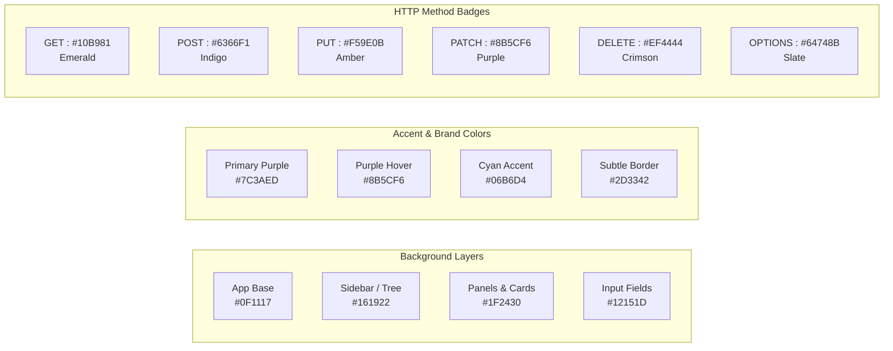

# UI/UX Design & Theme Specification — PyRestForge

> **Document Type**: Visual Design System, Layout Wireframes, & Component Specifications  
> **Status**: Approved UI/UX Design System  
> **Aesthetic Philosophy**: Modern, Sleek, Dark-Themed Developer Tool inspired by Insomnia & Linear

---

## 1. Design System & Visual Palette

### 1.1. Color Tokens (Dark Mode — Default)



| Token Name | Hex Code | Purpose / Application |
| :--- | :--- | :--- |
| `bg-app-root` | `#0F1117` | Main window base canvas and background |
| `bg-sidebar` | `#161922` | Workspace tree, navigation sidebar, and drawers |
| `bg-panel-surface` | `#1F2430` | Request builder tabs, response panels, table headers |
| `bg-input-field` | `#12151D` | URL bar, text fields, code editors |
| `border-subtle` | `#2D3342` | Splitter borders, table dividers, tab outlines |
| `border-focus` | `#7C3AED` | Active input outline, selected tree item glow |
| `text-primary` | `#F8FAFC` | Main headings, URL text, body editor code |
| `text-secondary` | `#94A3B8` | Field labels, table descriptions, unselected tabs |
| `text-muted` | `#64748B` | Inactive placeholders, disabled toggles |
| `badge-get` | `#10B981` | GET method label and badge |
| `badge-post` | `#6366F1` | POST method label and badge |
| `badge-put` | `#F59E0B` | PUT method label and badge |
| `badge-patch` | `#8B5CF6` | PATCH method label and badge |
| `badge-delete` | `#EF4444` | DELETE method label and badge |
| `badge-options` | `#64748B` | OPTIONS / HEAD method badge |
| `status-2xx` | `#10B981` | 200 OK / 201 Created status pill |
| `status-3xx` | `#3B82F6` | 301 / 302 Redirection status pill |
| `status-4xx` | `#F59E0B` | 400 Bad Request / 401 Unauthorized status pill |
| `status-5xx` | `#EF4444` | 500 Internal Server Error status pill |

---

## 2. Desktop Window Layout & Wireframes

### 2.1. Primary Three-Pane Layout

```text
+---------------------------------------------------------------------------------------------------------------+
|  PyRestForge   [Workspace: Billing Service v1 v]  [Env: Production v]  [+ New Request]  [Import] [Export] [⚙]  |
+------------------------------------+------------------------------------------+-------------------------------+
| SIDEBAR (Collections & Folders)    | REQUEST BUILDER                          | RESPONSE INSPECTOR            |
|                                    |                                          |                               |
| [🔍 Filter requests...]            | [POST v] [https://api.example.com/v1/auth/login ]  [Send (Ctrl+Enter)] |
|                                    +------------------------------------------+-------------------------------+
| v 📁 Authentication               | [Params (2)] [Headers (3)] [Auth] [Body*]| [200 OK]  [142 ms]  [3.2 KB]  |
|    [POST] Login User               +------------------------------------------+-------------------------------+
|    [POST] Refresh Token            | Mode: (o) JSON  ( ) Form  ( ) Raw  ( ) GQL| [Pretty] [Raw] [Preview] [Hdr]|
|    [GET]  Get Current User         | 1  {                                     | 1  {                          |
| v 📁 Users Management              | 2    "email": "{{user_email}}",          | 2    "status": "success",     |
|    [GET]  List Users               | 3    "password": "{{SECRET:user_pwd}}"   | 3    "access_token": "eyJ...",|
|    [POST] Create User              | 4  }                                     | 4    "expires_in": 3600       |
|    [PUT]  Update Profile           |                                          | 5  }                          |
|    [DEL]  Delete Account           |                                          |                               |
| > 📁 Subscriptions & Payments     |                                          |                               |
|                                    |                                          |                               |
+------------------------------------+------------------------------------------+-------------------------------+
| Status: Connected | HTTP/2 | SSL: Verified | Proxy: Off                      | JSONPath: [$.access_token   ] |
+---------------------------------------------------------------------------------------------------------------+
```

---

## 3. UI Component Hierarchy & Specifications

### 3.1. Sidebar Component (`SidebarWidget`)
- **Workspace Header Dropdown**: Allows instant switching between different API projects. Contains an "Add Workspace" button.
- **Search & Filter Input**: Real-time filtering with badge count of matched requests.
- **Action Toolbar**:
  - `+ Request` button.
  - `+ Folder` button.
  - Collapse / Expand All toggle.
- **Tree View Item Delegate**:
  - Custom painted items rendering a method chip (e.g. `POST` in indigo box with rounded corners), request title, and hover kebab menu (`...`).
  - Context Menu on Right-Click: *Rename*, *Duplicate*, *Delete*, *Copy as cURL*, *Export Selection*.

### 3.2. URL & Action Bar (`UrlBarWidget`)
- **HTTP Method Combo Box**: Styled with distinct color backgrounds matching the selected HTTP method.
- **URL Line Editor**:
  - Syntax highlighted: Host, path, and `{{variables}}` rendered in distinct token colors.
  - Auto-completion popup for environment variables when typing `{{`.
- **Send Button**:
  - Primary violet accent (`#7C3AED`) with hover animation.
  - Displays spinning loading indicator during active dispatch.
  - Automatically flips to "Cancel" button while request is in flight.

### 3.3. Request Tabs Container (`RequestTabsWidget`)
- **Params Tab**: Key-Value-Description table with automatic bidirectional synchronization with the URL bar query string. Includes a *Bulk Edit* toggle.
- **Headers Tab**: Key-Value table with pre-configured header completions, bulk edit mode, and active toggle checkboxes.
- **Auth Tab**: Segmented button or dropdown selector for auth types:
  - *Bearer Token*: Single line token field with variable support.
  - *Basic Auth*: Username and Password fields.
  - *API Key*: Key name, Value, and Target location (*Header* / *Query*).
  - *OAuth 2.0*: Complete OAuth grant form with "Generate Token" button.
- **Body Tab**:
  - Segmented control: `None | JSON | Form Data | URL Encoded | Raw | GraphQL | Binary`.
  - JSON Editor: Line numbers, syntax highlighting, bracket matching, and format/lint shortcuts.
  - Form Data: File attachment picker with browse button and text fields.
  - GraphQL: Split view for Query and Variables with JSON syntax highlighter.
- **Pre-Request Script & Tests Tab**: Python code editor with syntax highlighting for hooks and test assertions.

### 3.4. Response Inspector (`ResponseViewerWidget`)
- **Header Bar**:
  - Status Chip: e.g. `200 OK` in vibrant green capsule.
  - Latency: e.g. `128 ms` badge.
  - Payload Size: e.g. `4.1 KB` badge.
  - Actions: *Copy to Clipboard*, *Save to File*, *Clear*.
- **Sub-Tabs**:
  - *Response Body*: Modes: `Pretty` (JSON/XML folding), `Raw` (plain text), `Preview` (Rendered HTML/Images/Audio).
  - *Headers (N)*: Structured table of server response headers with copy icons.
  - *Cookies (N)*: Structured table of response cookies (Name, Value, Domain, Path, Flags).
  - *Timeline & SSL*: Interactive waterfall chart showing DNS, TLS, TTFB, and Transfer durations + Certificate info.
  - *Tests Results*: Pass/Fail assertions list with green checkmarks and red failure logs.
- **JSONPath Search Bar**: Fixed at the bottom for querying response data on the fly.

---

## 4. Typography & Icons

- **Primary UI Font**: `Inter`, `Segoe UI`, `SF Pro Display`, or system sans-serif.
- **Code & Editor Font**: `JetBrains Mono`, `Fira Code`, `Cascadia Code`, or `Consolas` with font ligatures enabled.
- **Icons**: Clean monochrome SVG icon set for navigation, actions, folders, and settings.

---

## 5. Keyboard Shortcuts & Accelerators

| Action | Windows / Linux Shortcut | macOS Shortcut |
| :--- | :--- | :--- |
| **Send Request** | `Ctrl + Enter` | `Cmd + Return` |
| **New Request** | `Ctrl + N` | `Cmd + N` |
| **New Folder** | `Ctrl + Shift + N` | `Cmd + Shift + N` |
| **Filter / Search Endpoints** | `Ctrl + F` | `Cmd + F` |
| **Manage Environments** | `Ctrl + E` | `Cmd + E` |
| **Import File (YAML / JSON)** | `Ctrl + I` | `Cmd + I` |
| **Export Collection** | `Ctrl + Shift + E` | `Cmd + Shift + E` |
| **Copy Request as cURL** | `Ctrl + Shift + C` | `Cmd + Shift + C` |
| **Format / Prettify JSON Body** | `Ctrl + Shift + F` | `Cmd + Shift + F` |
| **Toggle Sidebar** | `Ctrl + \` | `Cmd + \` |
| **Close Active Tab** | `Ctrl + W` | `Cmd + W` |
