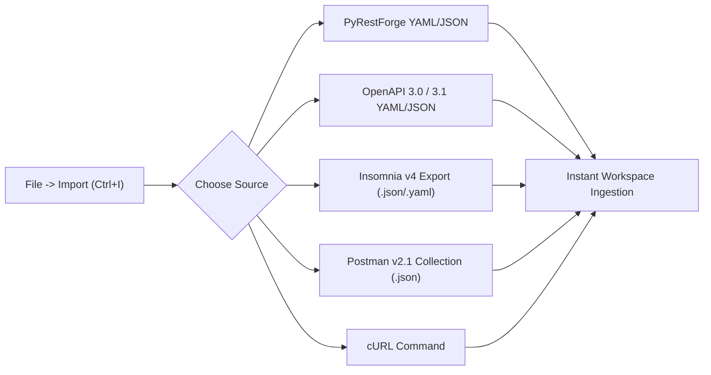

# User Manual & Operating Guide — PyRestForge

> **Document Type**: Comprehensive End-User Documentation  
> **Target Audience**: Developers, QA Engineers, API Designers, and DevOps Engineers

---

## 1. Introduction & Overview

**PyRestForge** is a fast, modern desktop API client and testing studio designed for developers who demand the clean organization and power of **Insomnia** with native Python performance, robust **YAML & JSON** collection management, OpenAPI synchronization, and scriptable test assertions.

```text
+---------------------------------------------------------------------------------------------------------------+
|  PyRestForge   [Workspace: Payment Service v2 v]  [Env: Staging v]   [+ New Request]  [Import] [Export] [⚙]   |
+------------------------------------+------------------------------------------+-------------------------------+
| SIDEBAR (Collections & Folders)    | REQUEST BUILDER                          | RESPONSE INSPECTOR            |
|                                    |                                          |                               |
| [🔍 Filter requests...]            | [POST v] [{{baseUrl}}/v2/payments/charge]  [Send (Ctrl+Enter)]           |
|                                    +------------------------------------------+-------------------------------+
| v 📁 Authentication               | [Params] [Headers (2)] [Auth] [Body (JSON)*] | [200 OK]  [89 ms]  [1.4 KB]    |
|    [POST] Authenticate             +------------------------------------------+-------------------------------+
| v 📁 Payments & Charges            | 1  {                                     | 1  {                          |
|    [POST] Create Charge            | 2    "amount": 2500,                     | 2    "id": "ch_9843a",        |
|    [GET]  Get Charge Details       | 3    "currency": "usd",                  | 3    "status": "succeeded",   |
|    [POST] Refund Charge            | 4    "customer_id": "{{customerId}}"     | 4    "created_at": 1775123456 |
| > 📁 Webhook Subscriptions         | 5  }                                     | 5  }                          |
+------------------------------------+------------------------------------------+-------------------------------+
```

---

## 2. Quickstart & Installation

### 2.1. Prerequisites
- Python 3.10, 3.11, 3.12, or 3.13
- Supported Operating Systems: Windows 10/11, macOS (Intel & Apple Silicon), Linux (Ubuntu, Fedora, Arch)

### 2.2. Installation Steps
```bash
# 1. Clone the repository
git clone https://github.com/your-org/pyrestforge.git
cd pyrestforge

# 2. Create and activate a virtual environment
python -m venv .venv
# On Windows:
.venv\Scripts\activate
# On Linux / macOS:
source .venv/bin/activate

# 3. Install dependencies
pip install -r requirements.txt

# 4. Launch the application
python src/main.py
```

---

## 3. Workspaces, Folders & Request Organization

### 3.1. Creating and Switching Workspaces
- Click on the **Workspace Selector** dropdown in the top-left toolbar.
- Choose **Manage Workspaces** $\rightarrow$ **+ New Workspace**.
- Name your workspace (e.g., `Order Management API`) and click **Create**.

### 3.2. Structuring Collections with Folders
- Click **+ New Folder** (`Ctrl+Shift+N`) in the sidebar toolbar.
- Folders can be nested to arbitrary depths (e.g., `Users` $\rightarrow$ `Admin` $\rightarrow$ `Permissions`).
- Reorder items effortlessly using **drag-and-drop**.

### 3.3. Managing Requests
- Click **+ New Request** (`Ctrl+N`).
- Select the initial HTTP method (`GET`, `POST`, `PUT`, `DELETE`, etc.) and give it a clear title.
- Right-click any request in the sidebar to access the context menu:
  - **Duplicate** (`Ctrl+D`): Clones request with all headers, params, body, and auth settings.
  - **Copy as cURL** (`Ctrl+Shift+C`): Generates a ready-to-paste cURL terminal command.
  - **Delete** (`Del`): Removes the request after confirmation.

---

## 4. Environments & Dynamic Variables

### 4.1. Managing Environment Variables
1. Click the **Environment Selector** in the top bar or press `Ctrl+E`.
2. Configure your **Base Environment** with shared variables:
   ```json
   {
     "apiVersion": "v1",
     "timeout": 30
   }
   ```
3. Add **Sub-Environments** (e.g., `Local`, `Staging`, `Production`):
   - **Local Development**:
     ```json
     {
       "baseUrl": "http://localhost:8000",
       "apiKey": "dev-local-key"
     }
     ```
   - **Production**:
     ```json
     {
       "baseUrl": "https://api.myapp.com",
       "apiKey": "live-secure-key"
     }
     ```

### 4.2. Using Variables in Requests
- In any URL, Header value, Param value, Auth field, or Request Body, type `{{variable_name}}`.
- An inline auto-completion dropdown appears showing available variables and their evaluated values.

### 4.3. Dynamic Built-in Generators
You can generate synthetic data on every request dispatch without writing code:
- `{{$guid}}` or `{{$uuid}}`: Generates a random UUID (e.g., `4f1a2380-6922-44df-94e8-8a8b2a3c74e1`).
- `{{$timestamp}}`: Current Unix epoch in seconds (e.g., `1775123456`).
- `{{$isoTimestamp}}`: Current ISO 8601 UTC timestamp (e.g., `2026-10-02T15:10:00Z`).
- `{{$randomInt, 1, 100}}`: Generates a random integer between 1 and 100.
- `{{$randomEmail}}`: Generates a unique email (e.g., `user_8492@example.com`).

---

## 5. Building & Sending Requests

### 5.1. Configuring Query Parameters (`Params` Tab)
- Add key-value pairs in the table.
- Toggle the checkbox to temporarily enable or disable specific parameters without deleting them.
- Switch to **Bulk Edit** mode to edit raw query strings.

### 5.2. Setting Headers (`Headers` Tab)
- Add custom headers (e.g., `X-Correlation-ID: {{correlation_id}}`).
- Built-in autocomplete suggests standard HTTP headers.

### 5.3. Authentication Schemes (`Auth` Tab)
Select from the supported authentication options:
- **Bearer Token**: Enter token or reference `{{token}}`.
- **Basic Auth**: Enter username and password; Base64 header is automatically generated.
- **API Key**: Enter key name, value, and choose placement in *Header* or *Query Param*.
- **OAuth 2.0**: Enter token URL, client credentials, and click **Fetch Token** to automatically populate your token.

### 5.4. Request Body Types (`Body` Tab)
- **JSON**: Full syntax highlighting, error checking, and auto-formatting (`Ctrl+Shift+F`).
- **Multipart Form-Data**: Mix text fields and file attachments using the file browser.
- **Form URL-Encoded**: Key-value pairs encoded automatically.
- **GraphQL**: Enter GraphQL Query and Variables separately with syntax highlighting.
- **Binary File**: Upload raw binary files (images, archives, audio).

---

## 6. Inspecting Responses

- **Status Code Chip**: Instant visual confirmation (Green = 2xx, Blue = 3xx, Orange = 4xx, Red = 5xx).
- **Latency & Size Badges**: See exact millisecond duration and transfer size.
- **View Modes**:
  - **Pretty**: JSON/XML with collapsible tree nodes, bracket highlighting, and search.
  - **Raw**: Pure text representation.
  - **Preview**: Rendered HTML pages, images, and audio waveforms.
- **Headers & Cookies**: Inspect server headers and Set-Cookie directives.
- **Network Timeline & SSL**: View DNS resolution, TLS handshake, TTFB, and download duration breakdown.

---

## 7. Importing & Exporting YAML and JSON Collections



### 7.1. Importing Collections
1. Click **Import** in the top navigation bar or press `Ctrl+I`.
2. Choose **Import from File**, **Import from URL**, or **Paste Raw Text / cURL**.
3. Select your `.yaml` or `.json` file. The format is auto-detected and imported into a new or existing workspace.

### 7.2. Exporting Collections
1. Click **Export** (`Ctrl+Shift+E`) in the top navigation bar.
2. Select export scope (*Entire Workspace* or *Selected Folder*).
3. Choose your desired export format:
   - **PyRestForge Native YAML** (Recommended for version control & team collaboration)
   - **PyRestForge Native JSON**
   - **OpenAPI 3.1 Specification (YAML/JSON)**
   - **Insomnia v4 Compatible Export**
   - **Postman Collection v2.1**
4. Choose whether to include or strip sensitive secrets, then save the file.

---

## 8. Chaining Requests & Writing Automated Tests

### 8.1. Extracting Tokens from Login Endpoint
In your Login request's **Tests** tab, add the following script:
```python
def test_login(res, env):
    # Verify successful login
    assert res.status_code == 200, f"Login failed with status {res.status_code}"
    
    # Parse JSON payload
    data = res.json()
    assert "token" in data, "Token missing from response payload"
    
    # Store token in active environment for subsequent requests
    env.set("jwt_token", data["token"])
    print("✓ JWT Token successfully saved to environment!")
```

### 8.2. Running Subsequent Authenticated Requests
In subsequent requests, simply set the **Auth** tab to **Bearer Token** with `{{jwt_token}}`. PyRestForge automatically uses the token extracted during login!

---

## 9. Multi-Language Code Snippet Generation

1. Configure any request with desired URL, headers, and body.
2. Click **Generate Code** (`Ctrl+G`) or right-click the request and select **Generate Code Snippet**.
3. Select your programming language of choice:
   - **Python** (`httpx` or `requests`)
   - **cURL** (POSIX / Windows cmd / PowerShell)
   - **JavaScript** (`fetch` or `axios`)
   - **Go** (`net/http`)
   - **Java** (`HttpClient` or `OkHttp`)
   - **PHP** (`cURL` or `Guzzle`)
4. Click **Copy to Clipboard** and paste directly into your codebase.

---

## 10. Troubleshooting & FAQ

- **Q: How do I disable SSL certificate verification for self-signed development certificates?**  
  *A: Go to Settings (⚙) $\rightarrow$ Network $\rightarrow$ Uncheck "Validate SSL Certificates". A warning badge will indicate SSL verification is bypassed.*
- **Q: Can I use PyRestForge behind a corporate HTTP / SOCKS5 proxy?**  
  *A: Yes. In Settings (⚙) $\rightarrow$ Proxy, enter your proxy URL (e.g. `http://proxy.corp.internal:8080`) and authentication credentials.*
- **Q: Where are my workspaces stored locally?**  
  *A: By default, workspaces are saved as human-readable YAML/JSON files in `~/.pyrestforge/workspaces/`.*
